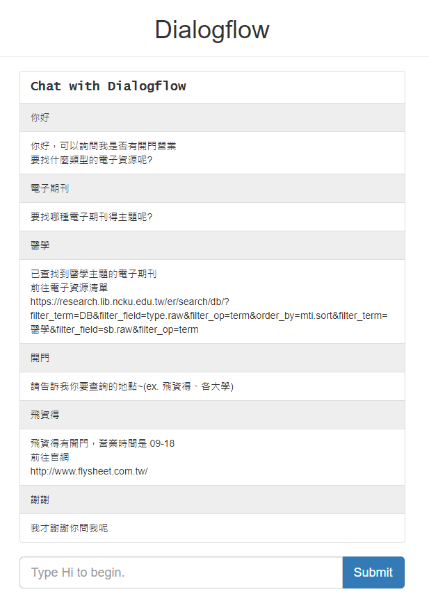

# DialogFlow with Django

Created: February 1, 2022 5:22 PM
Tags: Django, Python

Demo:




### Google DialogFlow 配置

1. 申請 DialogFlow API 
    
    
    
2. 建立憑證
    
    GCP > API 和服務 > 憑證 > 建立憑證 > 服務帳戶
    
    
    
    建立後點選新建的服務帳戶
    
    金鑰>新增金鑰>建立新的金鑰>取得憑證的 json 檔案
    
    ```python
    {
      "type": "service_account",
      "project_id": "YOUR_PROJECT_ID",
      "private_key_id": "...",
      "private_key": "...",
      "client_email": "...",
      "client_id": "...",
      "auth_uri": "https://accounts.google.com/o/oauth2/auth",
      "token_uri": "https://oauth2.googleapis.com/token",
      "auth_provider_x509_cert_url": "https://www.googleapis.com/oauth2/v1/certs",
      "client_x509_cert_url": "..."
    }
    ```
    
3. 建立 IAM
    
    IAM > 新增 > 新增成員(服務帳戶) > 角色(DiaglogFloge 代理人)
    
    
    
4. API 定價與用量限制
    
    [https://cloud.google.com/dialogflow/pricing#es-agent](https://cloud.google.com/dialogflow/pricing#es-agent)
    
    [https://cloud.google.com/dialogflow/quotas#es-agent](https://cloud.google.com/dialogflow/quotas#es-agent)
    

### Python Django Client 配置

1. 安裝 Python 套件
    
    ```python
    pip install google-cloud-dialogflow
    ```
    
2. 前端對話頁面
    
    每次進入對話頁面會獲取一個唯一的 uuid
    
    以辨識為同一個對話環境，進行上下文判斷
    
    html, js, css 請參考
    
    [https://github.com/priyankavergadia/Django-Dialogflow-GoogleVisionAPI](https://github.com/priyankavergadia/Django-Dialogflow-GoogleVisionAPI)
    
    ```json
    // js 呼叫 chat_view 添加 uuid
    var dialogflowChatUrl = ''; // add uuid
    // 設置 upload file path
    url_test = "https://ttime-demo.ivankaoblog.com/media/visionf/" + filename;
    // wellcome message
    window.onload = createRow('<p>你好\n1. 可以詢問我圖書館是否有開館\n2. 問要找什麼類型的電子資源\n3. 上傳圖片幫您辨識</p>');
    // submit done 清除上傳檔案、檔案狀態
    $submit.done(function(statement) {
        createRow(statement);
        // Clear the input field
        $input.val('');
        document.getElementById("inputGroupFile01").value = "";
        file_length_bool = true;
    });
    ```
    
    urls.py
    
    ```python
    from django.urls import path
    from django.views.decorators.csrf import csrf_exempt
    
    from . import views
    
    urlpatterns = [
        path('', views.HomeView.as_view(), name='index'),
        path('chat/<str:uuid>/', views.chat_view, name='chat-home'),
    
    ]
    ```
    
    views.py
    
    ```python
    import uuid
    from django.views.generic import TemplateView
    
    class HomeView(TemplateView):
        template_name = 'home.html'
    
        def get_context_data(self, **kwargs):
            context = super(HomeView, self).get_context_data(**kwargs)
            return context
    
        def get(self, request, *args, **kwargs):
            context = self.get_context_data()
            context['uuid'] = str(uuid.uuid4())
            return self.render_to_response(context)
    ```
    
3. 使用 API 
    
    用建立憑證取得的 json 檔案通過 google oath2 認證
    
    從 home 取得 uuid 進行對話
    
    對 text、card 進行處理
    
    views.py
    
    ```python
    import os
    import json
    import io
    
    from django.http import HttpResponse
    from django.views.decorators.csrf import csrf_exempt
    from django.views.decorators.http import require_http_methods
    
    from google.cloud import dialogflow
    
    @csrf_exempt
    @require_http_methods(['POST'])
    def chat_view(request, uuid):
        input_dict = convert(request.body.decode('utf-8'))
        input_text = json.loads(input_dict)['text']
    
        GOOGLE_AUTHENTICATION_FILE_NAME = "ApponintmentScheduler.json"
        current_directory = os.path.dirname(os.path.realpath(__file__))
        path = os.path.join(current_directory, GOOGLE_AUTHENTICATION_FILE_NAME)
        os.environ["GOOGLE_APPLICATION_CREDENTIALS"] = path
    
        GOOGLE_PROJECT_ID = "test-wmxo"
        session_id = uuid
    
        language_code = 'zh-TW'
        response = detect_intent_texts(
            project_id=GOOGLE_PROJECT_ID,
            session_id=session_id,
            language_code=language_code,
            texts=input_text
        )
        res_ful = response.query_result.fulfillment_messages._pb[0]
        if res_ful.text.text:
            res = res_ful.text.text[0]
            return HttpResponse(res, status=200)
        if res_ful.card.subtitle:
            res = res_ful.card.subtitle + '\n' + res_ful.card.buttons[0].text + '\n' + res_ful.card.buttons[0].postback
            return HttpResponse(res, status=200)
    
    def detect_intent_texts(project_id, session_id, texts, language_code):
        """Returns the result of detect intent with texts as inputs.
    
        Using the same `session_id` between requests allows continuation
        of the conversation."""
    
        session_client = dialogflow.SessionsClient()
        session = session_client.session_path(project_id, session_id)
    
        text_input = dialogflow.TextInput(text=texts, language_code=language_code)
        query_input = dialogflow.QueryInput(text=text_input)
        response = session_client.detect_intent(
            request={"session": session, "query_input": query_input}
        )
        return response
    ```
    

### Python Django Webhook  Fulfillment 配置

1. 建立 url
    
    ```python
    from django.urls import path
    from django.views.decorators.csrf import csrf_exempt
    
    from . import views
    
    urlpatterns = [
        path('', views.HomeView.as_view(), name='index'),
        path('chat/<str:uuid>/', views.chat_view, name='chat-home'),
        path('webhook/', csrf_exempt(views.DialogFlowView.as_view())), # 添加 webhook
    
    ]
    ```
    
2. 開啟 webhook
    
    
    
3. webhook 程式邏輯
    
    目前邏輯:
    
    1. 將請求解析為 json 格式
    2. 預設回應訊息(default)
    3. 判斷 action
        1. Google Maps API
        2. Google Vision API
        3. Search Article
    4. 判斷上下文
    
    ```python
    class DialogFlowView(View):
        def post(self, request, *args, **kwargs):
            req = json.loads(request.body)
            action = req.get('queryResult').get('action')
            text = {'fulfillmentText': '你好\n1. 可以詢問我圖書館是否有開館\n2. 問要找什麼類型的電子資源\n3. 上傳圖片幫您辨識'}
            
            # Google Maps API
            if action == 'get_place_name':
                place = req.get('queryResult').get('parameters').get('place')
                res = googlemap_client(place)
                if res['open_now']:
                    text = fulfillmentText(f"找到最相關地點為: {res['name']}\n現在是開館時間\n地址為: {res['formatted_address']}\n電話為: {res['formatted_phone_number']}\n本週開館時間為: {res['weekday_text']}")
                else:
                    text = fulfillmentText(f"找到最相關地點為: {res['name']}\n現在非開館時間\n地址為: {res['formatted_address']}\n電話為: {res['formatted_phone_number']}\n本週開館時間為: {res['weekday_text']}")
                return JsonResponse(text, safe=False)
    
            # Google Vision API
            if action == 'file_upload':
                filename = req.get('queryResult').get('parameters').get('filename')
                pslog_view(os.path.join(PROJECT_ROOT, f'../media/visionf/{filename}'))
                label_description, top_target = vision_client(os.path.join(PROJECT_ROOT, f'../media/visionf/{filename}'))
                pslog_view(label_description)
                pslog_view(top_target)
                pslog("圖片中包含: "+ ", ".join(label_description[:]))
                pslog("最可能為以下內容:"+ ", ".join(top_target[:]))
                text = fulfillmentText("圖片中包含: "+ ", ".join(label_description[:])+"\n"+"最可能為以下內容:"+ ", ".join(top_target[:]))
                return JsonResponse(text, safe=False)
    
            # Search Article
            if action == 'get_search_type':
                article_type = req.get('queryResult').get('parameters').get('articleType')
                text = fulfillmentText(f"要找哪種{article_type}的主題呢?")
                return JsonResponse(text, safe=False)
    
            # Output Context
            for output in req.get('queryResult').get('outputContexts'):
                article_type = output.get('parameters').get('articleType')
                if article_type:
                    ej_sb = req.get('queryResult').get('queryText')
                    card = fulfillmentCard(
                        '', f'已查找到{ej_sb}主題的{article_type}',
                        'https://yt3.ggpht.com/ytc/AAUvwng7mOpWyj6g2fF_8aXCvYWbNI45MpCXggu-1i0H=s900-c-k-c0x00ffffff-no-rj',
                        f'前往電子資源清單', f'https://research.lib.ncku.edu.tw/er/search/db/?filter_term=DB&filter_field=type.raw&filter_op=term&order_by=mti.sort&filter_term={ej_sb}&filter_field=sb.raw&filter_op=term'
                    )
                    return JsonResponse(card, safe=False)
    
            # Default Response
            return JsonResponse(text, safe=False)
    ```
    
4. Google Maps API
    
    傳入地點名稱
    
    找出最接近的地址、電話、是否營業、每週營業時間
    
    ```python
    def googlemap_client(input_text):
        gmaps = googlemaps.Client(key=os.environ.get('GOOGLEMAP_API_KEY'))
    
        # Search Place and get place_id
        places = gmaps.places(query=input_text, language='zh-TW', region='TW', type='library')['results']
        # Get Top place detail with place_id
        top_place = gmaps.place(place_id=places[0]['place_id'], language='zh-TW')['result']
        pslog_view(top_place)
        res = {}
        res['name']= top_place['name']
        res['formatted_address'] = top_place['formatted_address']
        res['formatted_phone_number'] = top_place['formatted_phone_number']
        res['open_now'] = top_place['opening_hours']['open_now']
        res['weekday_text'] = "\n".join(top_place['opening_hours']['weekday_text'])
        
        return res
    ```
    
5. Google Vision API
    
    傳入檔案名稱
    
    label_detection 分析圖片中的元素
    
    web_detection 分析整張圖片
    
    ```python
    def vision_client(file_name):
        os.environ["GOOGLE_APPLICATION_CREDENTIALS"] = '/opt/flysheetbot/src/df/ApponintmentScheduler.json'
        client = vision.ImageAnnotatorClient()
        # The name of the image file to annotate
        file_name = file_name
        # Loads the image into memory
        with io.open(file_name, 'rb') as image_file:
            content = image_file.read()
        image = vision.Image(content=content)
    
        # Performs label detection on the image file(output the possible label without score)
        response = client.label_detection(image=image)
        labels = response.label_annotations
        label_description = []
        for label in labels:
            label_description.append(label.description)
    
        # Performs web detection on the image file(I guess that the method just like google image search but capture the text from related site as output)
        response = client.web_detection(image=image,max_results=3)
        targets = response.web_detection.web_entities
        top_target= []
        for target in targets:
            top_target.append(target.description)
        # response = client.object_localization(image=image)
        # target2 = response.localized_object_annotations
        return label_description, top_target
    ```
    

5. 使用 df_response_lib 套件

純文字回應

```python
from .df_response_lib import *
class DialogFlowView(View):
    def post(self, request, *args, **kwargs):
        req = json.loads(request.body)
        if action == 'searchWelcome.userType':
            fulfillmentText = '測試文字'
            ff_response = fulfillment_response()
            ff_text = ff_response.fulfillment_text(fulfillmentText)
            reply = ff_response.main_response(ff_text)

        return JsonResponse(reply, safe=False)
```

添加上下文回應

```python
# 帶入 output_contexts
# 1. 變數名稱 
# 2. 生命週期
# 3. 變數值
from .df_response_lib import *
class DialogFlowView(View):
    def post(self, request, *args, **kwargs):
        req = json.loads(request.body)
        session = req.get('session')
        action = req.get('queryResult').get('action')
        if action == 'userType.Welcome':
            fulfillmentText = '測試文字'
            ff_response = fulfillment_response()
            ff_text = ff_response.fulfillment_text(fulfillmentText)
            ff_output_contexts = ff_response.output_contexts(session, [['testType','2',{'testType': '測試內容', 'testType.original': '測試內容'}]])
            reply = ff_response.main_response(ff_text, output_contexts=ff_output_contexts)

        return JsonResponse(reply, safe=False)
```

References

[https://github.com/googleapis/python-dialogflow](https://github.com/googleapis/python-dialogflow)

[https://googleapis.dev/python/dialogflow/latest/dialogflow_v2/documents.html](https://googleapis.dev/python/dialogflow/latest/dialogflow_v2/documents.html)

[https://cloud.google.com/dialogflow/es/docs/quick/api#detect_intent](https://cloud.google.com/dialogflow/es/docs/quick/api#detect_intent)

[https://stackoverflow.com/questions/51421926/dialogflow-permissiondenied-403-iam-permission-dialogflow-sessions-detectinten](https://stackoverflow.com/questions/51421926/dialogflow-permissiondenied-403-iam-permission-dialogflow-sessions-detectinten)

[https://github.com/priyankavergadia/Django-Dialogflow-GoogleVisionAPI](https://github.com/priyankavergadia/Django-Dialogflow-GoogleVisionAPI)

[https://www.youtube.com/watch?v=4wS3Wkjols4](https://www.youtube.com/watch?v=4wS3Wkjols4)

[https://github.com/pragnakalp/dialogflow-webhook-response-libary-in-python](https://github.com/pragnakalp/dialogflow-webhook-response-libary-in-python)

[https://github.com/pragnakalp/dialogflow-response-library-implementation-python-django/blob/master/views.py](https://github.com/pragnakalp/dialogflow-response-library-implementation-python-django/blob/master/views.py)