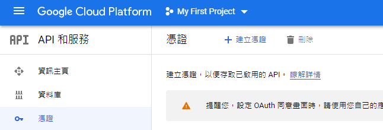

# Google Maps API

Created: May 2, 2021 6:58 PM
Tags: Python

1. 申請 Google Maps API 

    建立憑證 > API 金鑰

    

2. 測試

    ```python
    # example
    https://maps.googleapis.com/maps/api/place/nearbysearch/json?location=-33.8670522,151.1957362&radius=1500&type=restaurant&keyword=cruise&key=YOUR_API_KEY

    # test
    https://maps.googleapis.com/maps/api/place/findplacefromtext/json?input=麥當勞&inputtype=textquery&fields=photos,formatted_address,name,rating,opening_hours,geometry&key=YOUR_API_KEY
    ```

3. 安裝 python client

    ```python
    pip install -U googlemaps
    ```

4. 使用 API

    ```python
    def googlemap_client(input_text):
        # input_text = '政大圖書館'
        
        gmaps = googlemaps.Client(key=os.environ.get('GOOGLEMAP_API_KEY'))

        # Geocoding an address
        geocode_result = gmaps.geocode('1600 Amphitheatre Parkway, Mountain View, CA')

        # Look up an address with reverse geocoding
        reverse_geocode_result = gmaps.reverse_geocode((40.714224, -73.961452))

        # Request directions via public transit
        now = datetime.now()
        directions_result = gmaps.directions("Sydney Town Hall",
                                            "Parramatta, NSW",
                                            mode="transit",
                                            departure_time=now)
        # Search Place and get place_id
        places = gmaps.places(query='政大圖書館', language='zh-TW', region='TW', type='library')['results']
        # Get Top place detail with place_id
        top_place = gmaps.place(place_id=places[0]['place_id'], language='zh-TW')['result']
        pslog_view(top_place)
        res = {}
        res['name']= top_place['name']
        res['formatted_address'] = top_place['formatted_address']
        res['formatted_phone_number'] = top_place['formatted_phone_number']
        res['open_now'] = top_place['opening_hours']['open_now']
        res['weekday_text'] = "\n".join(top_place['opening_hours']['weekday_text'])

        return res
    ```

5. JSON example

    ```json
    {
        "address_components":[
           {
              "long_name":"36",
              "short_name":"36",
              "types":[
                 "street_number"
              ]
           },
           {
              "long_name":"萬壽路",
              "short_name":"萬壽路",
              "types":[
                 "route"
              ]
           },
           {
              "long_name":"木柵",
              "short_name":"木柵",
              "types":[
                 "neighborhood",
                 "political"
              ]
           },
           {
              "long_name":"政大里",
              "short_name":"政大里",
              "types":[
                 "administrative_area_level_4",
                 "political"
              ]
           },
           {
              "long_name":"文山區",
              "short_name":"文山區",
              "types":[
                 "administrative_area_level_3",
                 "political"
              ]
           },
           {
              "long_name":"台北市",
              "short_name":"台北市",
              "types":[
                 "administrative_area_level_1",
                 "political"
              ]
           },
           {
              "long_name":"台灣",
              "short_name":"TW",
              "types":[
                 "country",
                 "political"
              ]
           },
           {
              "long_name":"116",
              "short_name":"116",
              "types":[
                 "postal_code"
              ]
           }
        ],
        "adr_address":"<span class=\"postal-code\">116</span><span class=\"country-name\">台灣</span><span class=\"region\">台北市</span><span class=\"locality\">文山區</span><span class=\"street-address\">政大里萬壽路36號</span>",
        "business_status":"OPERATIONAL",
        "formatted_address":"116台灣台北市文山區萬壽路36號",
        "formatted_phone_number":"02 8237 7000",
        "geometry":{
           "location":{
              "lat":24.988457,
              "lng":121.5788895
           },
           "viewport":{
              "northeast":{
                 "lat":24.98972383029151,
                 "lng":121.5802094302915
              },
              "southwest":{
                 "lat":24.9870258697085,
                 "lng":121.5775114697085
              }
           }
        },
        "icon":"https://maps.gstatic.com/mapfiles/place_api/icons/v1/png_71/civic_building-71.png",
        "international_phone_number":"+886 2 8237 7000",
        "name":"國立政治大學達賢圖書館",
        "opening_hours":{
           "open_now":false,
           "periods":[
              {
                 "close":{
                    "day":1,
                    "time":"2145"
                 },
                 "open":{
                    "day":1,
                    "time":"0800"
                 }
              },
              {
                 "close":{
                    "day":2,
                    "time":"2145"
                 },
                 "open":{
                    "day":2,
                    "time":"0800"
                 }
              },
              {
                 "close":{
                    "day":3,
                    "time":"2145"
                 },
                 "open":{
                    "day":3,
                    "time":"0800"
                 }
              },
              {
                 "close":{
                    "day":4,
                    "time":"2145"
                 },
                 "open":{
                    "day":4,
                    "time":"0800"
                 }
              },
              {
                 "close":{
                    "day":5,
                    "time":"2145"
                 },
                 "open":{
                    "day":5,
                    "time":"0800"
                 }
              },
              {
                 "close":{
                    "day":6,
                    "time":"2145"
                 },
                 "open":{
                    "day":6,
                    "time":"0800"
                 }
              }
           ],
           "weekday_text":[
              "星期一: 08:00 – 21:45",
              "星期二: 08:00 – 21:45",
              "星期三: 08:00 – 21:45",
              "星期四: 08:00 – 21:45",
              "星期五: 08:00 – 21:45",
              "星期六: 08:00 – 21:45",
              "星期日: 休息"
           ]
        },
        "photos":[
           {
              "height":3448,
              "html_attributions":[
                 "<a href=\"https://maps.google.com/maps/contrib/117947100490856857053\">國立政治大學達賢圖書館</a>"
              ],
              "photo_reference":"ATtYBwJX-3oGagdTYtI6Y53DuTAt7hRMmUbagrgYCcX4i71RrLCmR1QEbVYvkxsF8fhS2poN2e8mhkEkWdkNOEVaeX2Rh3A5BlJwVSOaxw_WmL0H0VByCo-c60rU3_Zj8c8O30x4kBLnGhPWJiKkR1GzNzFkdpeRZME_Xo8yemqpk4iJtJCM",
              "width":5168
           },
           {
              "height":2973,
              "html_attributions":[
                 "<a href=\"https://maps.google.com/maps/contrib/106004451668210470424\">Clarence Liu</a>"
              ],
              "photo_reference":"ATtYBwI3u2QpcZKem0Yb8Lt4rbSePU0n0y7h4iNL8AJnes8AgzrUpRCnbsMu8V_gl1QSQHvj70cgjUSKcpvzMUR0vJHzRRAc7TM_Rrc6bpvgoJBVy3QOdTBCkGujy6OyzxUAgYwVJyC0l32C5O2EmyEEOfZyBUuO79dWGuXYlYJv8dE9DCcZ",
              "width":3964
           },
           {
              "height":6000,
              "html_attributions":[
                 "<a href=\"https://maps.google.com/maps/contrib/113686966718017257279\">洪昆布</a>"
              ],
              "photo_reference":"ATtYBwIuetoqt-3qW_XT18F013Avb9IDapUcEUKabue-1Xxp1LWPmHP1HDc4O95Xxf7bHzax_6AHhhp3PBFcy9ignjROKiLNw1qF8bkcpCnos9mkrpKMqZszTaC3BSq5In1H5-GtZYNagALOydkq0kToCo2oDixa90ZEEno_wOaWPyKjKo3J",
              "width":8000
           },
           {
              "height":1365,
              "html_attributions":[
                 "<a href=\"https://maps.google.com/maps/contrib/105431828400142620658\">upssmile chang</a>"
              ],
              "photo_reference":"ATtYBwJGEBuzUozIGVDpdrDw2sUZik51lfm4PhIIDXdzzPD6j0wTuFaVPZkErhYul2pzQN0SSkSXDDHofDogByd3raY_2GItHb8NSlNWdAQh5Cv_qAZ4Lvi6yq_B3JcEwnUohkQTLm3ICcvw-_IVoZKJk6MN2Nq38q0J2hZlRa-H54ryFF9m",
              "width":2048
           },
           {
              "height":3456,
              "html_attributions":[
                 "<a href=\"https://maps.google.com/maps/contrib/117947100490856857053\">國立政治大學達賢圖書館</a>"
              ],
              "photo_reference":"ATtYBwLy15917fBY5MZsUP3OY7-B5Phv1TrNeEHGjx_X-i2ToZgqPLNPFr1Ctj_mKTSg428qfkR-yaOtEi8L3j7PY0O4pnAo6ejap4064hX_g_ZllYPrbU_p9DgaJB8trbWCy9k740cW3EbWr_aLaGk3jwtcfUjuKfOS1DJozWkQxAz0pxyF",
              "width":5184
           },
           {
              "height":3024,
              "html_attributions":[
                 "<a href=\"https://maps.google.com/maps/contrib/112945051708963221668\">Chih-Wei Hsu</a>"
              ],
              "photo_reference":"ATtYBwIr1crtOSRAIl08UVSkOnIu_KmwPY3n60Z_Ptg5Z0-zvv7h8VlVjc7-vJTUaF8PHcvBE-IsGTBnCpzqEJDeFUISw6pQu8exoBHxvpj964bBDG_-EQ1RcEtxQkXRU0lS4wApMJwIamq96ECPCXls_lHKbKAG7gOtWoU_K67Wgscua095",
              "width":4032
           },
           {
              "height":3024,
              "html_attributions":[
                 "<a href=\"https://maps.google.com/maps/contrib/109818213956866856617\">孔慶霞</a>"
              ],
              "photo_reference":"ATtYBwKcvzQF6MiaWutIXUGqfjweqqeOOF8_IoaQd3OAR6QyW8V3LdlBqF5IxDWU3YjBbJeTTjmIQIwn-apVJh1nvhuUe1GV9tquJS834uLDjB6yEjeHacURm6wXYjzOcDT1jP67OsU5rIc0bvut8bMc4RjN3-dyQqYoPBBGJ7jLCt6fWZs-",
              "width":4032
           },
           {
              "height":3456,
              "html_attributions":[
                 "<a href=\"https://maps.google.com/maps/contrib/117947100490856857053\">國立政治大學達賢圖書館</a>"
              ],
              "photo_reference":"ATtYBwKd4XsL9S85-NgR1CLQncYzgnizSgQb6knQgLANoen5c4PAEzInttbLIUJuWb2fz4IunP8v5ki2yF7IutFEGRe09DDFN6orrGn9YcLQPxClWVn8wryEYJEfl_tEnWbtydmqswLi0FpYecp_hhPgGHGRuGOHR3CdR4jB52VpTyMFiTvg",
              "width":5184
           },
           {
              "height":3456,
              "html_attributions":[
                 "<a href=\"https://maps.google.com/maps/contrib/117947100490856857053\">國立政治大學達賢圖書館</a>"
              ],
              "photo_reference":"ATtYBwK_HoJV3CCemNbdwH6ZTXC0E8T6Y7CAp4UEFO45lqmg_mEHLXwx9hnQYR2wcw3y3nneIgPTYMJYqdNzGMlnizOlAvS2aUuYBnhu4VsFZI7wjWCQriaeoYRvcCSRXvtH4iGLhXdFSQIZAtynr4FFLatVd4cYoYdR06H6O2t2tNqQLcy8",
              "width":5184
           },
           {
              "height":3024,
              "html_attributions":[
                 "<a href=\"https://maps.google.com/maps/contrib/109888465897628910853\">盧小咪</a>"
              ],
              "photo_reference":"ATtYBwKAx6agi58FTkBEhgxGRo8r0aob3wyiHo7WNwhvEPMJJ5WAt14MveeDY-ScHylBNpNqfUWqA8Hi5X1_9c0Zub2CYzIiUoKxdtJBt1bBwzq8zpgG-NsQZnu3q3eVnCAQHd9C71wS_S_XDT-j64SQBbpH2hvjRLQPyCQ0gzfKSyxGdFru",
              "width":4032
           }
        ],
        "place_id":"ChIJwzg1xhurQjQR2nhRWn0K_Ic",
        "plus_code":{
           "compound_code":"XHQH+9H 台灣台北市文山區",
           "global_code":"7QP3XHQH+9H"
        },
        "rating":4.8,
        "reference":"ChIJwzg1xhurQjQR2nhRWn0K_Ic",
        "reviews":[
           {
              "author_name":"愛V向前走",
              "author_url":"https://www.google.com/maps/contrib/107844659399311048451/reviews",
              "language":"zh-Hant",
              "profile_photo_url":"https://lh3.googleusercontent.com/a-/AOh14GgR7UirIfuf4_EukBi53tGaW42jjb0jKCosRRerMw=s128-c0x00000000-cc-rp-mo",
              "rating":5,
              "relative_time_description":"1 個月前",
              "text":"館外：晚上燈光打在主建築物外牆，彷彿書本一字排開的設計感；而座落另一頭的湖濱閱讀小屋燈光照映著寧靜的湖邊，聽著青蛙的叫聲，真的讓人放鬆在此刻。\n\n館內：明亮且無限寬敞的閱讀空間及視聽空間，每樓層各有其特色；每個區域有不同的使用座椅及休閒空間；茶水間跟洗手間非常乾淨衛生。（白天陽光透過落地窗灑進館內，一定別有一番享受）\n\nP.S因開放校外人士換證入館，人多使用一定會增加環境維持的困難度，希望入內人士能夠共同維護如此優質的閱讀環境！",
              "time":1616851252
           },
           {
              "author_name":"潘裕霖",
              "author_url":"https://www.google.com/maps/contrib/100203564160719970392/reviews",
              "language":"zh-Hant",
              "profile_photo_url":"https://lh3.googleusercontent.com/a-/AOh14Gjo9Vg2q1cBQsRUzlEOtlOBoP77s8P-VZick2JhgA=s128-c0x00000000-cc-rp-mo-ba4",
              "rating":5,
              "relative_time_description":"2 個月前",
              "text":"達賢圖書館非常新，後面的小湖更是漂亮，引人入勝。在這邊讀書心情極好。\n大學圖書館為學生課後最常駐足停留的場所，圖書館的主要功能即在於提供豐富的資源、完善的環境、多元的服務，以支援師生教學、研究與學習需求。隨著資訊科技的迅速發展，網路世代(Net Generation)讀者成為大學圖書館主要服務對象，故圖書館應轉型以提供資訊服務為核心，結合建築空間及管理策略，開創符合時代趨勢的數位化圖書館。\n政大圖書館館藏量位居國內大學圖書館第二名，為人文社會科學資源典藏與研究重鎮，然而在數位時代快速變遷下，中正圖書館與分館的空間已達飽和，難以再規畫新穎的學習共享空間，建築硬體亦無法配合資訊科技的發展而受限，加上建築承載安全性隱憂，使本校圖書館面臨發展的瓶頸。\n政大圖書館自民94年起著手進行中正圖書館整建、擴建之可行性研究；民98年繼之為後山張家古厝藏書樓規劃；此外，與台灣大學圖書館、台灣師範大學圖書館、國家圖書館等共同向教育部提出聯合藏書樓計畫；民101年參與學校書院宿舍構想書之規劃，以上各項努力皆因不同的因素未能落實。\n民99年行政院終於同意將政大多年爭取、鄰近校園占地約10餘公頃之國防部指南山莊營區，正式核 撥予政大；民102年校方進行指南山莊校區規劃，擬於指山莊內建立「人本、生態、創意」的新大學校區，其中包含新建圖書館計畫；民104年政治大學正式取得指南山莊；民105年幸得校友慨捐指南 山莊全區規劃以及圖書館建築，捐贈者感念恩師司徒達賢老師的教導，命名為「達賢圖書館」。",
              "time":1613818063
           },
           {
              "author_name":"鄭竣丰",
              "author_url":"https://www.google.com/maps/contrib/116270984844989991561/reviews",
              "language":"zh-Hant",
              "profile_photo_url":"https://lh3.googleusercontent.com/a-/AOh14GjtTYJCUPDM7PQgvwGcHo1NS_VEq0o83dZVCbtW4A=s128-c0x00000000-cc-rp-mo-ba3",
              "rating":5,
              "relative_time_description":"本週",
              "text":"平常都在這做事，他就像一座豪華的工作別墅，每天都可以換不同的空間，看著不同的風景做事。讀累了可以去沒有人車吵鬧的步道走走，逛逛池塘，逗逗鴨鴨。在這做事真心舒服",
              "time":1619754862
           },
           {
              "author_name":"酪梨 Roni",
              "author_url":"https://www.google.com/maps/contrib/111048559852511036245/reviews",
              "language":"zh-Hant",
              "profile_photo_url":"https://lh3.googleusercontent.com/a-/AOh14Gi3xAQnQP4eA8g_mnMGesIxu8AwT5LLIZT_2VStlw=s128-c0x00000000-cc-rp-mo-ba4",
              "rating":5,
              "relative_time_description":"本週",
              "text":"我的小天堂～🤭\n\n修身養性，邁向達賢之路的好地方❤️\n\n在圖書館的窗邊體驗日夜的變化，\n好像可以感受到人生四季的轉換～",
              "time":1619712389
           },
           {
              "author_name":"Dong Lin Wu",
              "author_url":"https://www.google.com/maps/contrib/108826684109299783387/reviews",
              "language":"zh-Hant",
              "profile_photo_url":"https://lh3.googleusercontent.com/a-/AOh14GgJ2SqlcMQgQZYWZHG-8l2jcI0ov00JEzHreXU84w=s128-c0x00000000-cc-rp-mo-ba5",
              "rating":5,
              "relative_time_description":"本週",
              "text":"富麗堂皇，依山傍水，伴隨窗外藍天綠地\n整個人文氣息都高雅了起來\n不愧是東方哈佛..",
              "time":1619948491
           }
        ],
        "types":[
           "library",
           "point_of_interest",
           "establishment"
        ],
        "url":"https://maps.google.com/?cid=9798718422753835226",
        "user_ratings_total":268,
        "utc_offset":480,
        "vicinity":"文山區萬壽路36號",
        "website":"https://dhl.lib.nccu.edu.tw/"
     }
    ```

References

[https://googlemaps.github.io/google-maps-services-python/docs/index.html](https://googlemaps.github.io/google-maps-services-python/docs/index.html)

[https://github.com/googlemaps/google-maps-services-python](https://github.com/googlemaps/google-maps-services-python)