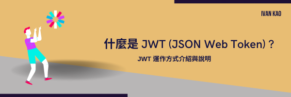

# 什麼是 JWT (JSON Web Token) ?



Created: April 12, 2022 10:30 PM  
Property: Ivan Kao  
Status: 已公開  
Tags: Web  

## JWT 簡介

JWT 全名為 JSON Web Token ，是一種基於 JSON 的開放標準(RFC 7519)，用於在雙方之間安全地將訊息作為 JSON 物件傳輸。

JWT 很簡潔，體積小傳輸速度快。

JWT 使用自包含(self-contained)的方式，payload 裡面就有所需要的資訊。

JWT 經過數位簽章(Digital Signature)，因此可以被驗證及信任。可以使用密碼或密鑰來對 JWT 進行簽章。

## JWT 的使用時機

1. 驗證(Authentication)
2. 授權(Authorization)
3. 訊息交換(Information Exchange)
4. 聯盟驗證 (Federated identity)
5. Client Session (無狀態 Session)
6. Client secrets

## JWT 的組成架構

JWT 是一組字串，透過（.）切分成三個為 Base64 編碼的部分：

1. **Header**：含 Token 的種類及產生簽章（signature）要使用的雜湊演算法
2. **Payload**：帶有欲存放的資訊（例如用戶資訊）
3. **Signature**：編譯後的 Header、Payload 與密鑰透過雜湊演算法所產生

```
// base64(Header) + base64(Payload) + base64(Signature)
// xxxxx.yyyyy.zzzzz
```

### Header

**必要欄位：**

- **alg**：對此 JWT 進行簽章和(或)解密的主要演算法，如**HMAC**、**SHA256**、**RSA。**對於未加密的 JWT，此聲明必須設置為 none。

**非必要欄位：**

- **typ**：JWT 本身的媒體類型。此參數僅助於將 JWT 與帶有 JOSE header 的其他對象混合使用的情況。實際上，這種情況很少發生。如果存在，則此聲明應設置為值 JWT。
- **cty**：內容類型。大多數 JWT 攜帶特定的聲明以及任意數據作為其 payload 的一部分，在這種情況下，不得設置內容類型聲明。對於 payload 本身是 JWT 自己（巢狀 JWT）的實例，此聲明必須存在並帶有值 JWT，用來表示需要進一步處理巢狀的 JWT。而巢狀 JWT 很少見，因此 cty 聲明很少出現在 header 中。
- 範例
    
    ```
    // 尚未編碼
    {
      "alg": "HS256",
      "typ": "JWT"
    }
    
    // 編碼後
    eyJhbGciOiJIUzI1NiIsInR5cCI6IkpXVCJ9
    ```
    

### Payload

這裡放的是聲明(Claim)內容，也就是用來放傳遞訊息的地方，在定義上有三種聲明：

1. Registered claims

可以想成是標準公認的一些訊息**建議**你可以放，但沒有強制性，包含：

- iss(Issuer)：JWT簽發者，表示這個 JWT 的唯一識別的發行方。
- sub(Subject)：JWT所面向的用戶，表示這個 JWT 所夾帶的唯一識別訊息。
- aud(Audience)：接收JWT的一方，表示這個 JWT 唯一識別的預期接收者。
- exp(Expiration Time)：JWT的過期時間，過期時間必須大於簽發JWT時間。
- nbf(Not Before)：也就是定義擬發放JWT之後，的某段時間點前該JWT仍舊是不可用的。
- iat(Issued At)：即該 JWT 發行的時間。
- jti(JWT Id)：JWT ID 的簡稱，一個字串表示這個唯一識別的 JWT。每個JWT的Id都應該是不重複的，避免重複發放。

2. Public claims

這個，可以想成是傳遞的欄位必須是跟上面Registered claims欄位不能衝突，然後可以向官方申請定義公開聲明，會進行審核等步驟，實務上在開發上是不太會用這部分的。

3. Private claims

這個就是發放JWT伺服器可以自定義的欄位的部分，例如實務上會放User Account、User Name、User Role等**不敏感**的數據。

所謂不敏感的數據就是不會放使用者的密碼等敏感數據，因為該Payload傳遞的訊息最後也是透過Base64進行編碼，所以是可以被破解的，因此放使用者密碼會有安全性的問題。

### Signature

簽章由三個部分組成

- base64UrlEncode(header)
- base64UrlEncode(payload)
- secret

header跟payload中間用**.**來串接，secret是存放在伺服器端的秘密字串，最後將這三個部分串接再一起的字串進行加密演算法進行加密。

```
HMACSHA256(
  base64UrlEncode(header) + "." +
  base64UrlEncode(payload),
  secret)
```

範例結果、

```
eyJhbGciOiJIUzM4NCIsInR5cCI6IkpXVCJ9.
eyJzdWIiOiIxMjM0NTY3ODkwIiwibmFtZSI6IkpvaG4gRG9lIiwiYWRtaW4iOnRydWUsImlhdCI6MTUxNjIzOTAyMn0.
bQTnz6AuMJvmXXQsVPrxeQNvzDkimo7VNXxHeSBfClLufmCVZRUuyTwJF311JHuh
```

JWT官網：[https://jwt.io/](https://jwt.io/) 有提供簽發工具可以進行測試。

## JWT 如何運作?

使用者端通過驗證登入後，伺服器端會發放一個 JWT

使用者端將 JWT 儲存在瀏覽器的 localStorage 中

使用者端向伺服器端訪問受保護的資源將 JWT 放在 HTTP 請求的 Authorization 中

```
Authorization: Bearer <token>
```

伺服器端檢查 token 是否有效，有效則允許使用者端訪問

## JWT 的優點

1. 因為 json 的通用性，所以 JWT 是可以進行跨語言。
2. 因為有了 payload 部分，所以 JWT 可以在自身存儲一些其他業務邏輯所必要的非敏感信息。
3. JWT 的構成非常簡單，字節佔用很小，所以它是非常便於傳輸的。 
4. 它不需要在伺服器端儲存 Session，所以它易於應用的擴展
5. 支持跨域請求，不會有傳統用Cookie進行跨域請求等問題
6. JWT 不僅可以用於認證，也可以用於交換訊息。有效使用 JWT，可以降低伺服器查詢資料庫的次數。

## JWT 的缺點

1. 由於伺服器不保存 session 狀態，不能強制停止某個 token，或者更改 token 的權限。一旦簽發了，在到期之前就會始終有效，除非伺服器有額外的邏輯。
2. 為了減少中間人攻擊，JWT 不應該使用 HTTP 協議明碼傳輸，要使用 HTTPS 協議傳輸。

### 參考資料

[https://medium.com/企鵝也懂程式設計/jwt-json-web-token-原理介紹-74abfafad7ba](https://medium.com/%E4%BC%81%E9%B5%9D%E4%B9%9F%E6%87%82%E7%A8%8B%E5%BC%8F%E8%A8%AD%E8%A8%88/jwt-json-web-token-%E5%8E%9F%E7%90%86%E4%BB%8B%E7%B4%B9-74abfafad7ba)

[https://jwt.io/introduction](https://jwt.io/introduction)

[https://5xruby.tw/posts/what-is-jwt](https://5xruby.tw/posts/what-is-jwt)

[https://learnku.com/articles/30051?order_by=vote_count&](https://learnku.com/articles/30051?order_by=vote_count&)
