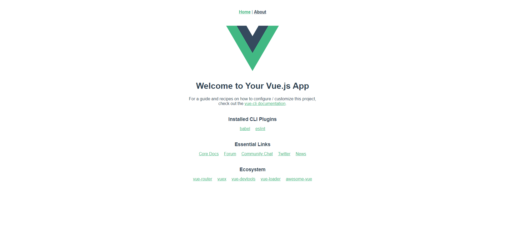
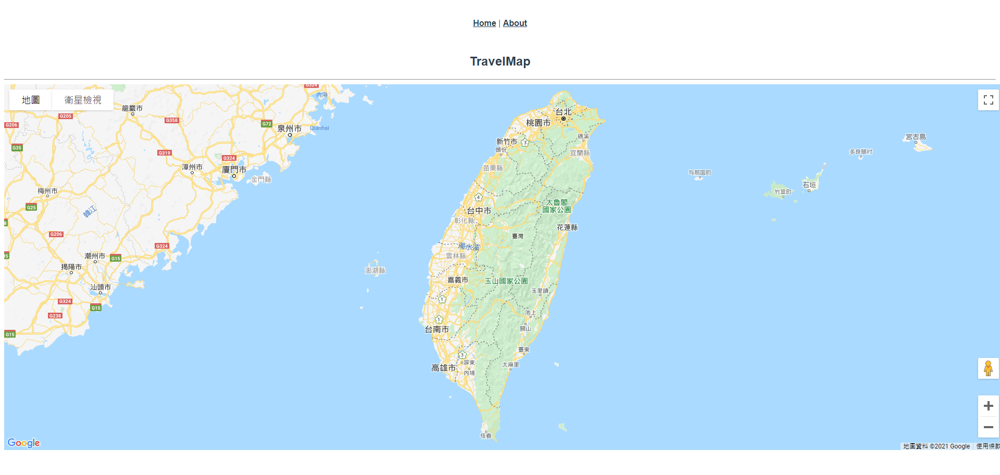

# vue-travel-map

## 一、環境建置

### 1. 安裝環境:  
```
npm install -g @vue/cli
```

### 2. 創建專案:  
```
vue create vue-travel-map
```
>選擇 vue2.x 版本

### 3. 安裝套件
```
vue add router
npm install --save google-maps-api-loader
```

### 4. 創建 .env 設置環境變量
在根目錄創建 .env 檔案，並將 googlemap 的 apikey 寫在其中  
```
 VUE_APP_GOOGLEMAPAPIKEY="yourApiKey"
```

### 5. 當前目錄結構  
```
.
├── babel.config.js
├── .env
├── .git
├── .gitignore
├── node_modules
├── package.json
├── package-lock.json
├── public
├── README.md
└── src
    ├── App.vue
    ├── assets
    ├── components
    ├── main.js
    ├── router
    └── views
```

### 運行專案
```
npm run serve
```



## 二、初次建立地圖

### 1. 在 src/components 建立 GoogleMapLoader.vue 地圖元件

```html
<template>
  <div>
    <div class="google-map" ref="googleMap"></div>
    <template v-if="Boolean(this.google) && Boolean(this.map)">
      <slot
        :google="google"
        :map="map"
      />
    </template>
  </div>
</template>
```

```js
<script>
import GoogleMapsApiLoader from 'google-maps-api-loader'

export default {
  props: {
    mapConfig: Object,
    apiKey: String,
  },
  data() {
    return {
        google: null,
        map: null,
    }
  },
  async mounted() {
    const googleMapApi = await GoogleMapsApiLoader({
      apiKey: this.apiKey
    })
    this.google = googleMapApi
    this.initializeMap()
  },

  methods: {
    initializeMap() {
      const mapContainer = this.$refs.googleMap
      this.map = new this.google.maps.Map(mapContainer, this.mapConfig)
    }
  }
}

</script>
```

### 2. 在 src/views 創建 TravelMap.vue 顯示地圖頁面

```html
<template>
  <div class="travel-map">
    <div>
      <h2>TravelMap</h2>
      <hr>
      <div>
        <div>
          <GoogleMapLoader ref="googlemaploader"
            :mapConfig="mapConfig"
            :apiKey="apiKey"
          >
          </GoogleMapLoader>
        </div>
      </div>
    </div>
  </div>  
</template>
```

```js
<script>
// @ is an alias to /src
import GoogleMapLoader from '@/components/GoogleMapLoader'

export default {
  components: {
    GoogleMapLoader,
  },
  data(){
    return {
      apiKey : process.env.VUE_APP_GOOGLEMAPAPIKEY,
    }
  },
  computed: {
    mapConfig () {
      return {
        zoom: 8,
        center: this.mapCenter
      }
    },
    mapCenter () {
          return {lng: 120.93891, lat: 23.60278}
    }
  },
}
</script>

```
> apiKey 會調用 .env 檔的 VUE_APP_GOOGLEMAPAPIKEY 設定值
```css
<style>
.google-map {
  width: 100vw;
  height: 75vh;
}
</style>
```
> 須設定 style 才會正常顯示地圖

### 3. 在 src/router/index.js 添加 travelmap 路由設定

```js
import Vue from 'vue'
import VueRouter from 'vue-router'
import Home from '../views/Home.vue'

Vue.use(VueRouter)

const routes = [
  {
    path: '/',
    name: 'Home',
    component: Home
  },
  {
    path: '/about',
    name: 'About',
    // route level code-splitting
    // this generates a separate chunk (about.[hash].js) for this route
    // which is lazy-loaded when the route is visited.
    component: () => import(/* webpackChunkName: "about" */ '../views/About.vue')
  },
  // 添加 travelmap
  {
    path: '/travelmap',
    name: 'travelmap',
    component: () => import(/* webpackChunkName: "gotravel" */ '../views/TravelMap.vue')
  },
]

const router = new VueRouter({
  mode: 'history',
  base: process.env.BASE_URL,
  routes
})

export default router

```

### 4. 查看當前頁面
前往 localhost:8080/travelmap 查看當前頁面
